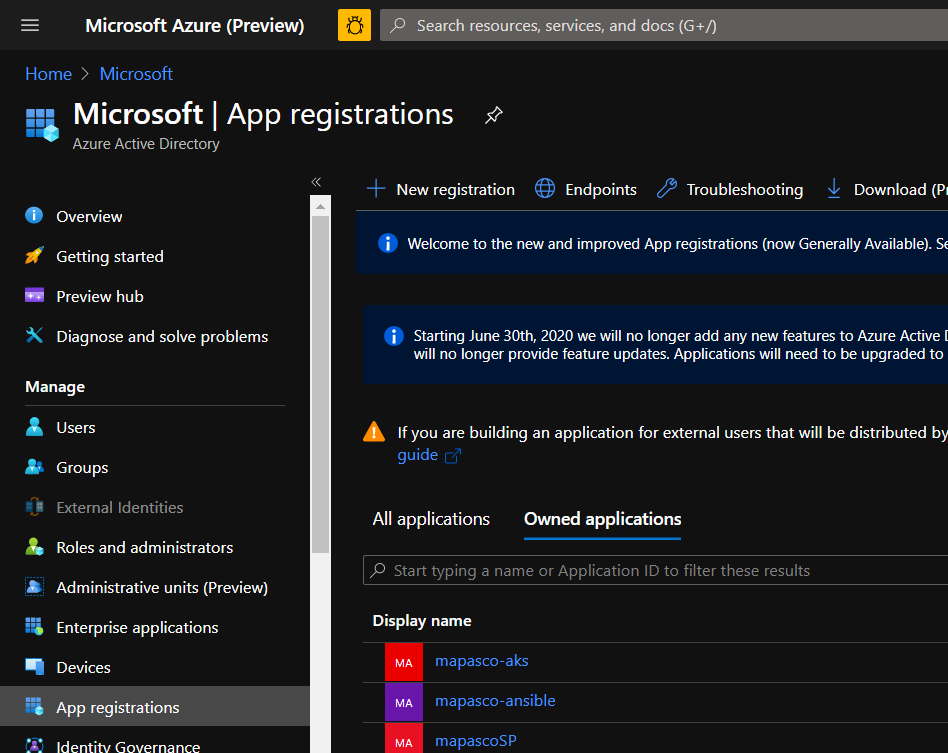
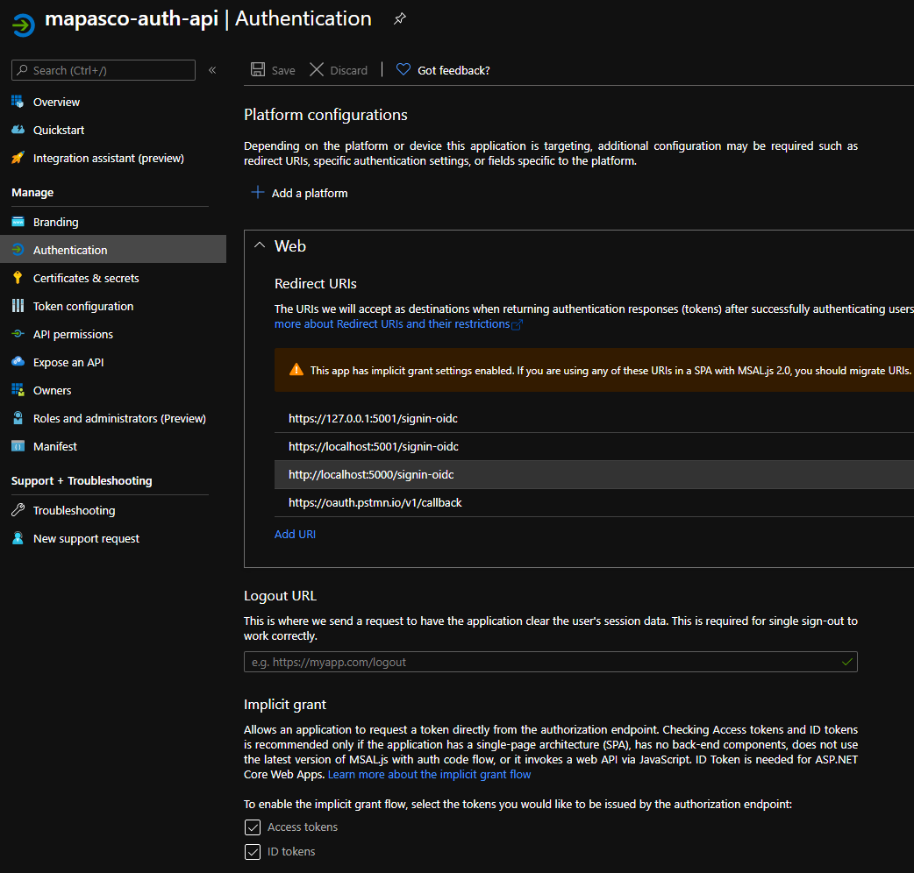
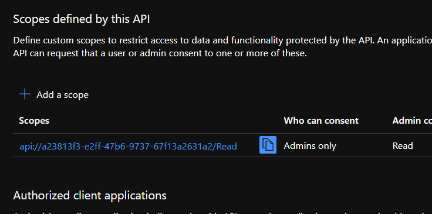
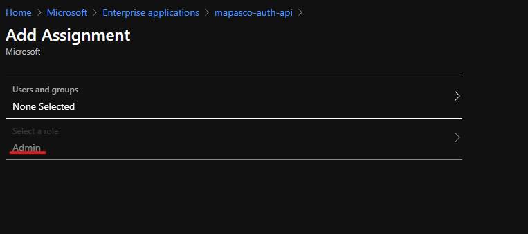

# OAuth API
In this repo ASP.NET authentication and authorization middleware is 
demonstrated. This API provides support for both JSON Web Tokens (JWT) and 
cookie based authentication

# How it works
When the user hits an API, ASP.NET routes the traffic to a specific controller. 
The controller **or** the route may contain an authorization 
[requirement](#Add-the-authorization-requirement-to-the-API-route). This 
requirement may contain both policies, authentication schemes, or role claims.

If a user is unauthenticated, the middleware will reject the user with HTTP 401 
unauthenticated. If the user is authenticated, but is not authorized with the 
route the middleware will reject the request with HTTP 403 unauthorized. 


# Auth flow
1. The user authenticates with Microsoft's Oauth Service targeted at the APIs
service account registration

2. Upon successful authentication, the client receives an authorization code.

3. The user requests an access token, using the authorization code. This access
token is used when the client calls the API.

4. The user makes requests to the API using the access token. This token is 
cryptographically signed, and the API verifies the token was correctly signed
by the authentication authority (Microsoft). If these checks are met, the API
grants access to the user.

# Authorization Claims
When the user authenticates with Microsoft's Oauth endpoint the user is issued
claims. Claims are things such as your name, your role, and the scopes you
allowed the API to control. These claims are embedded in your JSON Web Token or
in your cookie.

Here is a list of claims from [Azure AD docs](https://docs.microsoft.com/en-us/azure/active-directory/develop/id-tokens#payload-claims).

# Authentication Methods
## JSON Web Tokens (JWTs)
JSON Web Tokens, JWT, is a cryptographically signed and base64 encoded JSON blob
that contains the authorization claims of a user. The JWT contains a message 
digest (often HMAC-256) which is a one-way hash signed by the private key of the
 authentication provider (Microsoft). JWT verifiers compute the the same one way
 hash and validate using the authentication providers public key to decrypt the 
provided encrypted signature (hash).

```
PubKey(PriKey(hash)) == hash
```
Since only the authentication authority knows its private key, we know it must 
have come from the correct authority.

## Cookie Based Authentication
Authentication cookies are just like normal cookies, however they are encrypted 
via your authentication authority (e.g., Microsoft AAD). The API will validate 
the cookie is legitament, otherwise the API will redirect your client to the 
Microsoft Login Page.

## JWT vs Cookie auth
JWTs are useful in APIs and client applications (i.e., mobile apps and desktop 
apps)

Cookies are typically only used in the browser applications. If you are building
an API where a user needs to interact with something on the page, this is most 
useful.

# Authentication Middleware

## Provide an authentication scheme
The following code provides an authentication scheme. This defines the method of
authentication (e.g., JWT) and parameters to validate against (e.g., 
login.microsoftonline.com/tenant-id)
```cs
// This value can be anything unqiue to your set of authentication schemes.
public const string JWT_SCHEME = "Bearer"

...

services.AddAuthentication(sharedoptions =>
{
	sharedoptions.DefaultScheme = JWT_SCHEME;
})
.AddJwtBearer(options => 
{
	...
});
```

To see it in this example, see 
[here](src/Oauth.API/Authentication/AzureAuthenticationServiceConfiguration.cs)

## Define an authentication policy
Policies work in conjunction with authentication schemes to add additional 
authorization requirements. Once the authentication middleware parses claims 
from the authentication scheme (contained in the cookie or JWT), a policy can 
require certain claim values.

```cs
options.AddPolicy("Allow Bill Gates", policy =>
{
	// Only allow authenticated users with claim Name equal to Bill Gates
	policy.RequireClaim("name", "Bill Gates");
});
```

## Add the authorization requirement to the API route
The following API route defines that only users authenticated with a JWT and a 
claim for Name equal to Bill Gates
```cs
[HttpGet]
[Authorize(
	AuthenticationSchemes = JWT_SCHEME, 
	Policy="Allow Bill Gates"
)]
public IActionResult Get()
{
	return Ok("Welcome Bill");
}
```

## (Optional) Add route specific role claim requirements
Instead of defining many seperate policies, the role claim can be added to
the authorization attribute. The following requires the admin role. This can be
combined with `AuthenticationSchemes` and `Policy` attributes.
```cs
[HttpGet]
[Authorize(Roles = "Admin", ...]
public IActionResult Get()
{
	...
}
```

## Extending Policies Further
Policies can match against any of the users claims. The values that are matched 
against do not have to be static. In fact, you could use the users GUID to look
up their groups via Microsoft Graph. 


# API Registration (Service Principal)

## Create a Service Principal
Creating a service principal can be done either through the azure portal or the
azure cli. Since we will need to modify some manifest settings, the portal will
be easier.



## Configure Platform configurations

### For Web Add a web platform configuration 
This will include redirect URLs point to your web app's domain. This is used 
for cookie based interactive login flow.

### For JWT and Apps
Enable Implict grant with Access Tokens


## Add a scope




## Define Roles for your API
Here we can define custom roles for our application. If a user or service 
principal is assigned a role for this application. A role claim will be added 
to either the JWT or Cookie.

To add a role, navigate to your applications manifest in the Azure AD portal. 
The following code defines a role called `Admin` but can be tailored for any
use. For the Id, make sure you use a GUID unique to each role you add.

```json
"appRoles": [
	{
		"allowedMemberTypes": [
			"User"
		],
		"description": "Admins can do anything",
		"displayName": "Admin",
		"id": "<Guid unique to this set of app roles>",
		"isEnabled": true,
		"lang": null,
		"origin": "Application",
		"value": "Admin"
	}
],
```

## Add Role to User or Group 
In Azure AD navigate to the Enterprise Applications, and find your application.
Under users and groups, add your selected User, Service Principal, or Group to 
the application and you will see the role we added above.



Official Microsoft [docs](https://docs.microsoft.com/en-us/azure/active-directory/develop/active-directory-enterprise-app-role-management).


## Update your app settings
In your `appsettings.<env>.json` add the following configuration:

```json
{
  "Logging": {
    "LogLevel": {
      "Default": "Information",
      "Microsoft": "Warning",
      "Microsoft.Hosting.Lifetime": "Information"
    }
  },
  "AzureAd": {
    "Instance": "https://login.microsoftonline.com/",
    "https": null,
    "Domain": "login.microsoftonline.com",
    "TenantId": "<your-tenant-id>",
    "ClientId": "<your-service-principals-client-id",
    "CallbackPath": "<your-callbackpath>"
  }
}
```
These can also be intialized as environment variables.

*Note the double undescore*
```sh
$ export AzureAd__Instance="https://login.microsoftonline.com/"
```

The callback path should match the value you configured in your service 
principal registration. A common value is `/signin-oidc` See [here](#For-Web-Add-a-web-platform-configuration) for more info.